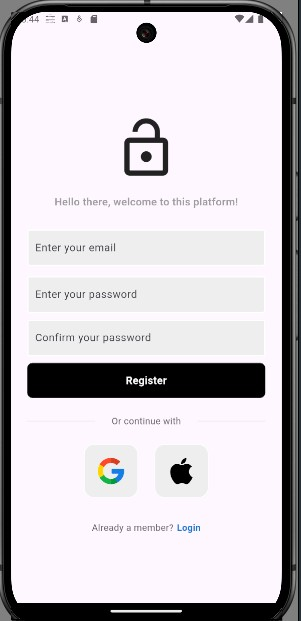

# FlutterAuth

This is a full flutter authentication implementation using Flutter and Firebase.

## Features

- Login  
- Register
- Logout
- Google Sign In

First here is the UI (User Interface) for the Login and the Register pages.

### Login

### Register

This implements Google Sign In for both Android and Ios platfoms

## License

[MIT](https://choosealicense.com/licenses/mit/)

## Contributing

Contributions are always welcome!
